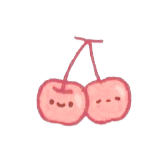
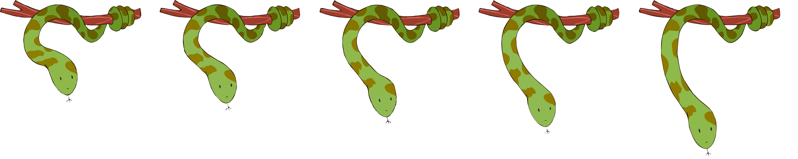

# My-First-Game
A simple game coded when I  was a freshman

# Table of of Contents
-[Information](https://github.com/tranthanhvan235/Bam-Bam-Venom#information)

## Information
**Name:**  Trần Thị Thanh Vân  
**Student ID:** 23020168  
**Class:** K68CD  
**Email:** vanvanvan2305@gmail.com  

## Gameplay
   Move the snake down to eat the fruit. If the snake eats that fruit, it will receive points. On the contrary, if the snake eats an obstacle or plank, it will lose its life. When its life runs out, it loses.

### Mode 1: 1 Player
   The fruit will automatically fall. After you eat a certain number of points, the game will level up, by increasing the movement speed of fruits, obstacles and wooden boards.
### Mode 2: 2 Player
   The two-player mode will have one person dropping fruits and obstacles, and one person controlling the snake. The game will end if the snake controller runs out of lives.

### Objective

### Fruits & Obstacles
    These are some fruits and obstacles in the game:
#### Fruits
       

#### Wood

### Snake
    The snake is the main character in this game, it moves by clicking on the screen or using down arrows or space bar.

### Score
    For each edible fruit you will receive 10 points.
    The score will be displayed at the top-left corner of the screen.
### Lives
    Lives will be displayed at the top-right corner of the screen. You will lose when you run out of lives.

### Controls
- `Space, Down arrow keys` to move the snake (Bam Bam).
- `S key` to drop fruit for two-player mode.
- `P key` to pause the game.

### Screenshots

### Demo

[Link]().

## Credits

Special thanks to:
- All teachers in course `INT2215 51 - Advanced Programming` for their enthusiasm and knowledge.
- All my former Informatics teachers in `Thai Binh Gifted High School` and `Thai Binh National Olympiad in Informatics Team` for my knowledge in data structures and algorithms.
- [Lazy Foo' Productions](https://lazyfoo.net/tutorials/SDL/index.php) for their tutorials on SDL2.
- [SDL2](https://www.libsdl.org/) for their library.
- GitHub for powerful coding tools.

In this game, I used:

- [Hack MD](https://hackmd.io/) for writing this document
- [Canva](https://www.canva.com/) for creating images.
- [Fonts](https://www.dafont.com) for some text in my game.
- [Music](https://soundbible.com/)
- [Sound effects](https://soundbible.com/)
